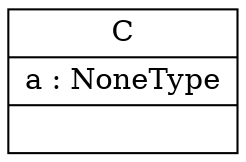
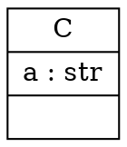

### **Objective: Enhance `pyreverse` to Support Python Type Hints for UML Generation**

The user wants to improve `pyreverse` to recognize and use Python type hints (PEP 484) when generating UML class diagrams. Currently, `pyreverse` infers types from default values, leading to incorrect type information when `None` is used as a default for a typed variable.

**Example Problem:**

```python
class C(object):
    def __init__(self, a: str = None):
        self.a = a
```

**Current Incorrect Output:** The generated diagram shows `a : NoneType`.
**Expected Correct Output:** The diagram should show `a : str`.

---

### **1. Exploration and Bug Reproduction**

The agent started by exploring the `pylint/pyreverse` directory to understand the codebase. Key files examined were:
- `pylint/pyreverse/diagrams.py`: Handles diagram creation and structure.
- `pylint/pyreverse/inspector.py`: Inspects the code and extracts information.
- `pylint/pyreverse/writer.py`: Writes the diagram to a file (e.g., in DOT format).   

To reproduce the issue, the agent created a test script (`test_type_hints.py`) with a class containing type hints and ran `pyreverse` on it.

```python
# test_type_hints.py
class C(object):
    def __init__(self, a: str = None):
        self.a = a
```

Running `pyreverse` generated a `classes.dot` file.

**Generated `classes.dot` content:**

This confirmed the bug, as `a` was incorrectly identified as `NoneType` instead of `str`.

---

### **2. Identifying the Root Cause**

Through debugging, the agent identified the root cause in `pylint/pyreverse/inspector.py`. The `handle_assignattr_type` function was using `node.infer()` to determine the type of class attributes. This method infers the type from the assigned value at runtime. In the case of `a: str = None`, `infer()` correctly identifies the type of the default value `None` as `NoneType`, ignoring the `str` type hint.

---

### **3. Implementing the Fix**

The agent planned and implemented a two-part fix:

1.  **Update `inspector.py` to Prioritize Type Hints:**
    The `handle_assignattr_type` function was modified to check for type annotations on function arguments (`__init__` parameters in this case) before falling back to type inference. This ensures that if a type hint is present, it is used as the primary source for the attribute's type.

2.  **Update `writer.py` to Display Type Hints in Methods:**
    The `DotWriter` class was updated to include type hints for method parameters and return values in the generated diagram.

**Code Changes:**

-   In `pylint/pyreverse/inspector.py`, the logic was updated to look for `func_node.args.annotations` and use the annotation's type information if available.
-   In `pylint/pyreverse/writer.py`, the method signature generation was modified to format and include the type hints for each argument and the return value (e.g., `method(param: str) -> int`).

---

### **4. Verification and Testing**

After applying the fixes, the agent re-ran `pyreverse` on the test script.

**New `classes.dot` output:**

This output is correct, showing `a : str`.

The agent then performed comprehensive testing:
-   Ran the existing `pylint` test suite to ensure no regressions were introduced. All tests passed.
-   Created more complex test cases with various type hints (`List`, `Dict`, `Optional`, `Union`) to ensure the solution was robust.
-   Verified that classes without type hints were still processed correctly.

The final verification confirmed that the fix was successful and addressed the user's issue completely. The temporary test files were then removed.